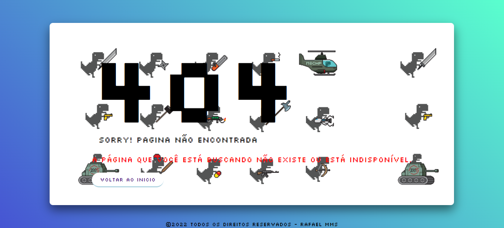

## Sobre:

Essa página foi desenvolvida para aprimorar meus conhecimentos em HTML, CSS e principalmente o JavaScript, onde tenho focado para fixar bem e ter um bom entendimento para conseguir usar. Fiz essa página acompanhando um tutorial no youtube, porém fui fazendo do meu jeito mudando algumas coisas para deixar como queria, é uma página simples, onde quando o usuário passa o mouse sobre ela a imagem de background se movimenta, isso graças ao JavaScript. Irei fazendo algumas melhorias, como na responsividade e ir implementando algumas outras funções legais nela mais a frente, para assim aprender mais e ter uma página bem intuitiva.
 

 

Link para visualizar a página:
https://rafamms013.github.io/Pagina-erro-404/

## Tecnologias usadas:
<li>HTML</li>
<li>CSS</li>
<li>JavaScript</li>

## IDE usada:
<li>Visual Studio Code</li>

## Referências:
<li>Canal no YouTube: Online Tutorials</li>
<li>Imagem usada no ícone e background: Google imagens</li>
